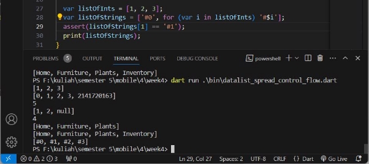
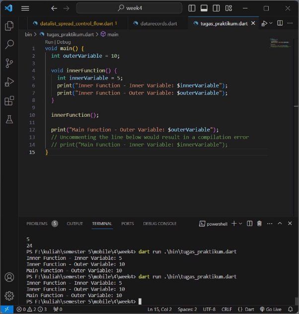

Tugas Praktikum 

1. Practicum 1: Data List Type Experiment 

Step 1: 

Type or copy the following program code into void main(). 

Step 2: 

Please try executing (Run) the code in step 1. What happened? Explain! 

This dart code creates an array (list), performs some assertions to ensure specific conditions are met, and prints the length and elements of the list to the console. It demonstrates basic array manipulation and debugging techniques in Dart. 

Step 3: 

Change the code in step 1 to become a final variable that has index = 5 with default value = null. Fill in your name and NIM in the 1st and 2nd index elements. Then print and capture the results. 

What happened? If an error occurs, please correct it. 

The code above experiences an error because the list declaration is 'List<int?>' which means it only contains integer or null type values. However I filled the elements with string data type. 

Code that has been corrected: 

2. Practicum 2: Data Set Type Experiment 

Step 1: 

Type or copy the following program code into the main() function. Step 2: 

Please try executing (Run) the code in step 1. What happened? Explain! Then fix it if an error occurs. 

The code above does not produce an error. The code above is an example of using a "Set" in Dart, which is  a collection of unique elements. The code contains the names of halogen elements, and then the contents of the set are printed to the screen with the names of the halogen elements. 

Step 3: 

Add the following program code, then try executing (Run) your code. 

What happens? If there is an error, please fix it but still use all three variables. 

- Actually, there is no error, but 'names3' is actually an empty map, not a set. If you want to create a set, make sure to specify the data type as seen in 'names1' and 'names2'. 

Add your name and NIM elements to the two Set variables with two different functions, namely .add() and .addAll(). The Map variable is deleted, we will try it later in the next practicum. 

3. Practicum 3: Data Maps Type Experiment 

Step 1: 

Type or copy the following program code into the main() function. 

Step 2: 

Please try executing (Run) the code in step 1. What happened? Explain! Then fix it if an error occurs. 

No errors occurred, and produced output as instructed by print gifts and nobleGases. 

Step 3: 

Add the following program code, then try executing (Run) your code. What happened? If an error occurs, please correct it. 

Actually it didn't produce an error, but because I created two new folders, namely 'mhs1' and 'mhs2', the contents of which were empty. This is different from the two initial folders 'gifts' and 'nobleGases' which already contain contents and have key-value pairs that match the specified data type. 

4. Practicum 4: List Data Type Experiments: Spread and Control-flow Operators 

Step 1: 

Type or copy the following program code into the main() function. Step 2: 

Please try executing (Run) the code in step 1. What happened? Explain! Then fix it if an error occurs. 

Experiencing an error because previously there was no 'list1' variable declaration. Therefore, there is a code improvement by replacing 'list1' with 'list' and producing the output as below 

Step 3: 

Add the following program code, then try executing (Run) your code.  

What happened? If an error occurs, please correct it. Add a list variable containing your NIM using Spread Operators. Document the results and make a report! 

The code above occurs an error when running, because there is a writing error in the variable where the variable declaration is 'list1' but tries to access it as 'list1' in the 'list3' statement. This causes an error because 'list1' was not declared previously. To improve the code below, add the variables var and nim and produce the output below 

Step 4: 

Add the following program code, then try executing (Run) your code. 

What happened? If an error occurs, please correct it. Show the result if the promoActive variable is true and false. 

An error occurred when running the code above because the proActive variable was not declared or did not have a clear value. 

- If the variable is true 

- If the variable is false 

Step 5: 

Add the following program code, then try executing (Run) your code. 

An error occurred during the run process because there was no definition of the variable name 'login' previously. 

In the displayed output it can be explained that the 'Inventory' element is included in 'nav2' only if the value of the 'login' variable is 'Manager'. if 'login' is not the same as 'Manager', then 'Inventory' will not be included in nav2 

Step 6: 

Add the following program code, then try executing (Run) your code. 

What happened ? If an error occurs, please correct it. Explain the benefits of Collection For and document the results. 

- No error occurs because the code above creates two lists: listOfInts which contains the numbers [1, 2, 3], and listOfStrings which is created with a for-in expression that adds a '#' sign in front of each element in listOfInts. The result is a listOfStrings containing ['#0',  '#1',  '#2',  '#3'].  The  assert  statement  checks  whether  the  1st  element  in listOfStrings is '#1', which is true. Finally, the results of listOfStrings are printed using print. 
- Collection for allows creating declarative data collections based on source collections, producing code that is more concise and easy to read, and makes it easier to transform and manipulate data in the Dart programming language. 

5. Practicum 5: Data Records Type Experiment 

Step 1: 

Type or copy the following program code into the main() function. Step 2: 

Please try executing (Run) the code in step 1. What happened? Explain! Then fix it if an error occurs. 

The code above experienced an error when run because there was no sign; at the end of the code. 

Step 3: 

Add the following program code outside the scope of void main(), then try executing (Run) your code. What happened ? If an error occurs, please correct it. 

What happened? If an error occurs, please correct it. Use the exchange() function in main() so that the process of exchanging field values in Records is clearly visible. 

No error occurred, but code outside the scope of void main() was not executed 

Step 4: 

Add the following program code in the void main() scope, then try executing (Run) your code. 

What happened ? If an error occurs, please correct it. Initialize your name and NIM fields in the student record variable above. Document the results and make a report! 

When running the program above, an error occurs due to calling var student which has not been given any value. Then improve it by assigning values to student variables according to the record annotation type, namely String and Integer 

Step 5: 

Add the following program code in the void main() scope, then try executing (Run) your code. 

What happened? If an error occurs, please correct it. Replace one of the contents of the record with your name and NIM, then document the results and make a report! 

6. Practicum Assignment 
2. Jelaskan yang dimaksud Functions dalam bahasa Dart! 

Functions in Dart are blocks of code used to execute specific tasks. Functions can receive arguments, perform logic, and return values (if needed). They are used to organize code in a modular way, allowing for reuse and structuring code more effectively. 

3. Jelaskan jenis-jenis parameter di Functions beserta contoh sintaksnya! 
1. Positional Optional Parameters (Optional Parameters) 

Positional optional parameters are parameters that do not need to be provided when calling a function and can be omitted if not needed. 

In this code, the optional parameters age and country are marked as nullable by using int? and String?, respectively, to indicate that they can be null. This aligns with Dart's non-nullable by default feature. 

2. Default Value (Default Parameter) 

A default parameter is an optional parameter with a default value that will be used if no argument is provided when calling the function. 

In this code, we have a function printInfo that takes a required name parameter and two optional parameters age and country. Both optional parameters have default values assigned. When calling the function, if you don't provide values for the optional parameters, their default values will be used. 

3. Named Parameter (Dynamic Optional Parameter) 

These parameters do not need to be provided when calling a function, and you can specify them by name when calling the function. 

In this code, we have a function printInfo that uses named parameters. You can specify the parameter values by name when calling the function, which allows you to provide them in any order or omit them if you don't need to change the default values. 

4. Required Parameter (Mandatory Parameter) 

Required parameters are parameters that must be provided when calling a function and cannot be omitted. 

In this code, we have a function printInfo that takes two required parameters: name and age. When calling the function, both of these parameters must be provided, and omitting any of them will result in a compilation error. 

4. Jelaskan maksud Functions sebagai first-class objects beserta contoh sintaknya! 

Functions as first-class objects refer to the ability to treat functions just like any other objects, such as strings, numbers, or other objects. This means that you can manipulate functions like variables, store them in variables, pass them as arguments to other functions, return them from other functions, and so on. An example syntax is as shown in the image below. 

In this code, we define two functions add and subtract. We also declare a variable operation that can store functions with a specific signature. We then demonstrate storing functions in variables, passing functions as arguments to another function, and using functions as first-class objects. 

5. Apa itu Anonymous Functions? Jelaskan dan berikan contohnya! 

An Anonymous Function in Dart is a function that doesn't have a name and is often referred to as a lambda or closure. These functions are commonly used to write more concise code and can be assigned to variables or used in various contexts, such as adding them to or removing them from collections. Anonymous functions have parameters similar to named functions and are declared without a function name. An example syntax can be seen in this image. 

In this code, we use anonymous functions to define the logic for adding and subtracting numbers. These anonymous functions are then passed as arguments to the performOperation function. Additionally, we demonstrate how to assign an anonymous function to a variable and use it to perform a multiplication operation. 

6. Jelaskan perbedaan Lexical scope dan Lexical closures! Berikan contohnya! The difference between Lexical Scope and Lexical Closure 
1. Lexical Scope: Variables have a scope determined by the static structure of the code. You can see where a variable is by looking at the code layout. 

In this code, we have an outerVariable declared in the main function, and an innerFunction defined within the main function. The innerFunction has its own innerVariable. Notice that we can access the outerVariable from within the innerFunction because it is in the lexical scope of innerFunction. However, trying to access the innerVariable from outside the innerFunction (in the main function) would result in a compilation error because it's not in the lexical scope of the main function. Lexical scope determines where variables are accessible based on their location in the code. 

2. Lexical Closures: Functions can access variables in their surrounding scope, even when the function is used outside its original scope. The function "closes" these variables, allowing them to remain accessible. 

In this code, we have an outerVariable declared in the main function, and a closureFunction that  defines  an  innerVariable  and  an  innerFunction.  The  closureFunction  returns  the innerFunction, creating a closure. When we call closureFunction, it returns the innerFunction, which still has access to both innerVariable and outerVariable, even though it's used outside the original scope of closureFunction. 

When we call closure(), it prints the values of innerVariable and outerVariable, demonstrating that the inner function has access to variables from its surrounding lexical scope, creating a lexical closure. 

7. Jelaskan dengan contoh cara membuat return multiple value di Functions! 

In Dart, we can return multiple values from a function by packaging the values into an appropriate object or data type. One common way is to return a list. Here's the code to create a function that returns multiple values using a list: 

In this code, the getPersonInfo function returns a list containing multiple values: name, age (converted to a string), and country. In the main function, we call getPersonInfo to retrieve these values and then extract and use them as needed. This allows us to effectively return and work with multiple values from a function using a list. 

Github Link: [https://github.com/aminyG/Mobile_Programming/tree/main/week4 ](https://github.com/aminyG/Mobile_Programming/tree/main/week4)
